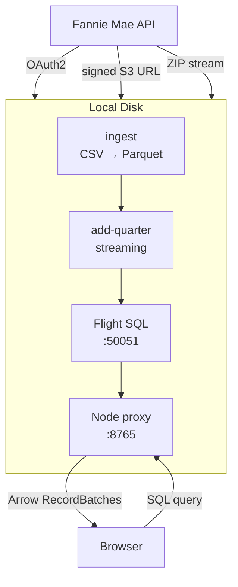

# Fannie Mae Loan Performance — DataFusion Analytics

Full pipeline for Fannie Mae single-family loan performance data: fetch, convert, store, and query **~751 million rows** across 32 quarters (2018–2025) using Apache DataFusion and [DuckLake](https://github.com/datafusion-contrib/datafusion-ducklake).

## Architecture



## Quick Start

```bash
# Build everything
cd ingest && cargo build --release
cd ../flight-server && cargo build --release --bin flight-sql-server --bin add-quarter

# Ingest a quarter (downloads ZIP, converts to Parquet)
cd ..
source .env
./ingest/target/release/fannie-ingest --year 2024 --quarter Q1 --output test-data/2024Q1.parquet

# Add to DuckLake catalog (streaming, 500k-row chunks)
cp test-data/2024Q1.parquet flight-server/data/
cd flight-server
./target/release/add-quarter --data-dir data --parquet data/2024Q1.parquet --max-memory-mb 4000
rm data/2024Q1.parquet

# Start the server + proxy
./target/release/flight-sql-server --data-dir data --parquet data/seed.parquet &
cd public && APP_PASSWORD=demo node server.mjs &

# Open http://localhost:8765 — password: demo
```

### Docker

```bash
cd flight-server
docker build -t fannie-flight .
docker run -d --name fannie-flight \
  -p 8765:8765 \
  -v ./data:/app/data \
  -e APP_PASSWORD=yourpass \
  -e TUNNEL=1 \
  fannie-flight:latest
```

Set `TUNNEL=1` to auto-start a [Cloudflare Tunnel](https://developers.cloudflare.com/cloudflare-one/connections/connect-networks/) for public access via `*.trycloudflare.com`.

## Dataset

**32 quarters** (2018 Q1 – 2025 Q4), ~751 million rows.

| Year | Rows | Notes |
|------|-----:|-------|
| 2018 | 78M | Pre-COVID baseline |
| 2019 | 79M | Steady market |
| 2020 | 235M | COVID refi boom (Q4: 80M) |
| 2021 | 236M | Peak refi era (Q1: 73M) |
| 2022 | 73M | Market cooling |
| 2023 | 27M | Rate hikes hit originations |
| 2024 | 17M | Continued decline |
| 2025 | 6M | Low-volume market (Q4: 0.5M) |

**Schema:** 113 columns — loan characteristics, borrower credit, property details, performance flags. See [CRT File Layout PDF](http://capitalmarkets.fanniemae.com/sites/capmrkt/files/2023-06/crt-file-layout-and-glossary.pdf).

The 2025 Q4 data (effective date: July 2026) is the most recent available. Fannie Mae releases with a ~6-month lag; 2026 Q1 is not yet published.

## Project Structure

```
.
├── ingest/                          # DataFusion 54 CSV→Parquet + Fannie Mae API
│   ├── Cargo.toml
│   └── src/main.rs                  # CLI: fetch, download ZIP, extract, convert
├── flight-server/                   # Flight SQL server + browser client
│   ├── Cargo.toml                   # DataFusion 54 + DuckLake 0.5 + Arrow Flight
│   ├── Dockerfile                   # debian:trixie-slim, 804MB, bind-mount data
│   ├── docker-entrypoint.sh         # Starts server → proxy → optional tunnel
│   ├── start.sh                     # Host launch: server + proxy + Tailscale
│   ├── src/
│   │   ├── main.rs                  # Flight SQL server + DuckLake catalog
│   │   ├── lock.rs                  # File locking (prevent concurrent writes)
│   │   └── bin/
│   │       ├── add_quarter.rs       # Streaming Parquet→DuckLake ingest
│   │       └── test_client.rs       # Test queries against Flight SQL
│   ├── public/
│   │   ├── index.html               # Browser query UI (dark theme)
│   │   ├── server.mjs               # Node proxy: password gate + gRPC-web
│   │   └── src/app.js               # @sparrowflight/js Flight SQL client
│   └── data/                        # (bind-mounted) DuckLake catalog
│       ├── catalog.db               # SQLite metadata
│       └── datalake/                 # UUID-named Parquet chunks
├── wasm-query/                      # DataFusion WASM demo (separate branch)
├── test-data/                       # Source Parquet files (backup copies)
├── docs/                            # Implementation notes
├── scripts/setup-env.sh             # Reads secrets/datadynamics.yaml → .env
├── .pi/skills/                      # Cloudflare agent skills
└── ARCHITECTURE.md                  # Original architecture analysis
```

## Key Design Decisions

| Decision | Rationale |
|----------|-----------|
| **Flight SQL over WASM** | 33× faster (500ms vs 4.8s), no browser download, supports full SQL |
| **DuckLake over raw Parquet** | Schema enforcement, snapshots, SQL `ADD FILES`, time travel |
| **Streaming ingest** | `execute_stream()` + 500k-row chunks — never loads full CSV into memory |
| **File locking** | `flock()` prevents concurrent `add-quarter` + `flight-server` (SQLite corruption) |
| **Docker bind mount** | Catalog stays on host, image is only 804MB, no data baked in |
| **Cloudflare Tunnel** | Zero-config public access, no firewall rules, free |
| **Node proxy** | Password gate, gRPC-web support, CORS, serves static files |
| **DF 54 everywhere** | Single version across ingest + flight-server (upgraded from DF 47) |

## Query Examples

```sql
-- Total rows
SELECT count(*) FROM ducklake.main.loans;

-- Average loan amount by year
SELECT
  CASE
    WHEN loan_id LIKE '%2018%' THEN '2018'
    WHEN loan_id LIKE '%2019%' THEN '2019'
    -- ...
  END as year,
  count(*) as loans,
  round(avg(original_upb), 0) as avg_upb
FROM ducklake.main.loans
GROUP BY 1 ORDER BY 1;

-- Credit score distribution
SELECT
  round(borrower_credit_score_at_origination / 50) * 50 as score_bucket,
  count(*) as cnt
FROM ducklake.main.loans
WHERE borrower_credit_score_at_origination > 0
GROUP BY 1 ORDER BY 1;
```

## Credentials

Copy `.env.example` to `.env` and fill in:

- `FANNIE_CLIENT_ID` / `FANNIE_CLIENT_SECRET` — Fannie Mae developer portal app
- `APP_PASSWORD` — password for the browser query UI (default: `demo`)

## API Reference

| Item | Value |
|------|-------|
| API base | `https://api.fanniemae.com` |
| Token endpoint | `https://auth.pingone.com/4c2b23f9-52b1-4f8f-aa1f-1d477590770c/as/token` |
| Auth flow | OAuth2 client credentials |
| Auth header | `x-public-access-token: {token}` (not `Authorization: Bearer`) |
| Endpoint | `GET /v1/sf-loan-performance-data/years/{year}/quarters/{quarter}` |
| Response | `{ lphResponse: [{ s3Uri, year, quarter }] }` |
| ZIP contents | Single pipe-delimited CSV, no header, 113 columns |

## TODO

- [ ] **Save queries** — After SvelteKit consolidation: server-side SQLite CRUD with prepared statements, or localStorage for zero-server version.
- [x] **Consolidate Node proxy into SvelteKit** — `server.mjs` wraps SvelteKit handler (adapter-node) alongside gRPC-web proxy. One Docker container, one port.
- [ ] **Fix docs page URLs** — Connection examples hardcode `http://localhost:8765`. Replace with relative/generic references so they make sense when accessed via Cloudflare Tunnel.
- [ ] **Permanent Cloudflare Tunnel URL** — Ephemeral `*.trycloudflare.com` quick tunnels rotate on restart. Free tier option: named tunnel + Cloudflare-owned domain gives stable subdomain (`fannie-mae.example.com`). Requires Cloudflare account + domain in your account.
- [x] **Expose Flight SQL (:50051) remotely** — Published from Docker, tunneled alongside :8765. Python/ADBC clients connect directly, guard-rails prevent abuse.

## License

Refer to [Fannie Mae's website](https://capitalmarkets.fanniemae.com/credit-risk-transfer/single-family-credit-risk-transfer/fannie-mae-single-family-loan-performance-data) for all data licensing questions.
